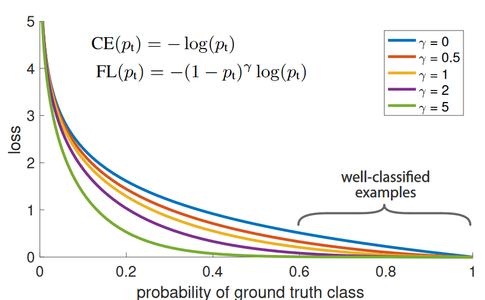

# Implementation focal loss based on keras 

<h2 align="center">Features</h2>

- **Support binary and multiclass.**
- **Both support tf.keras 2.0 and keras.**
- **Less code.**

<h2 align="center">Install</h2>

```
pip install focalloss4keras
```
<h2 align="center">Example</h2>

```
import tensorflow as tf
import tensorflow.keras as keras
import numpy as np
from focal_loss import FocalLoss
```

```
# build model
num_classes = 3
model = keras.Sequential([
    keras.Input(shape=(784, )),
    keras.layers.Dense(32, activation='relu'),
    keras.layers.Dense(32, activation='relu'),
    keras.layers.Dense(32, activation='relu'),
    keras.layers.Dense(num_classes)
])
```

```
# prepare data
X = np.random.randn(10000, 784)
y = np.random.randint(0, num_classes, (10000, ))
y = tf.one_hot(y, num_classes, dtype=tf.float32)
```

```
# train model
model.compile(optimizer="adam", loss=FocalLoss(alpha=[0.4, 0.3, 0.3]), metrics=["acc"])
model.fit(X, y)
```

